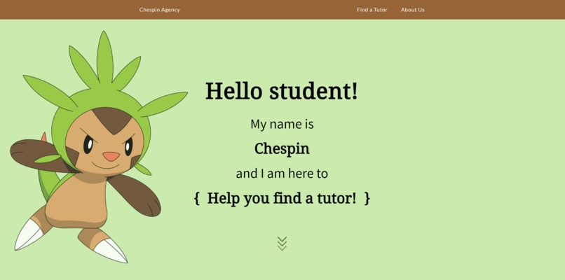

# Project Chespin
Goal: Develop a tutor recommender engine for NUS Hack&Roll 2020 in a 24h hackathon

## Features and Implementation
- Frontend: HTML + CSS and form integration with firebase using Zapier + Cognito Forms
- Recommender: SpaCy NLP, Google Map API, Firebase integration 
- Parent fills up tutor requirements on the front page before top 3 tutors of the best fit to the requirements are recommended 

## Project Links
- Devpost: https://devpost.com/software/chespin
- Project status: Recommender is not successfully implemented and code is not public at the moment. 

## Future Work:
- To improve the recommender model 
- To collect tutors' data for training and beta testing for live implementation of the recommender engine 
